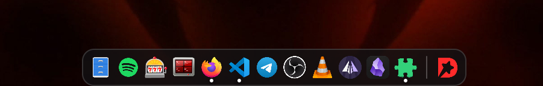
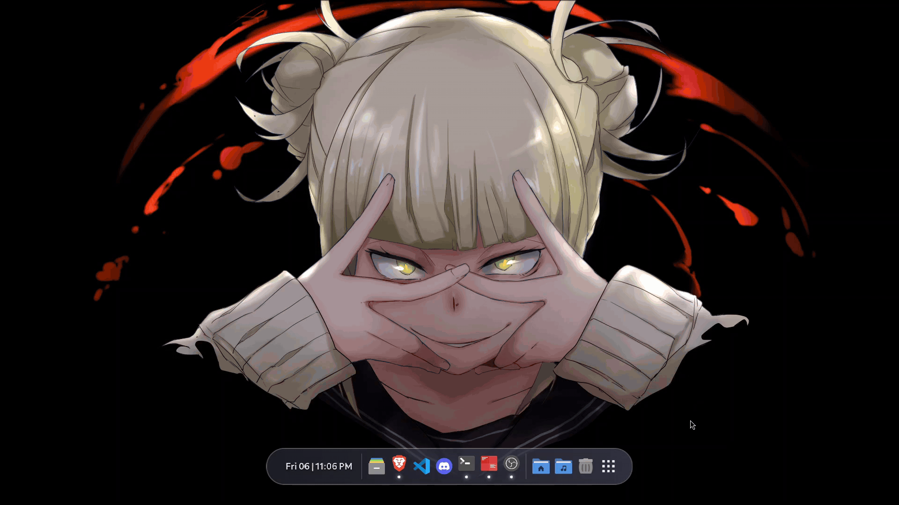
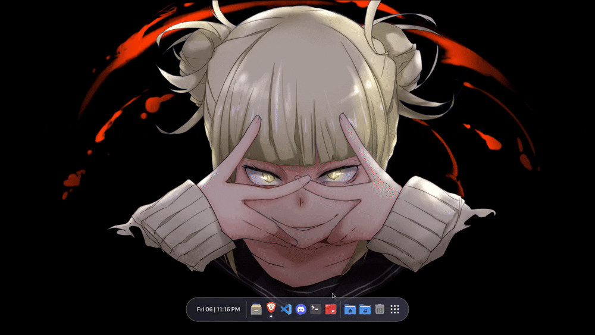
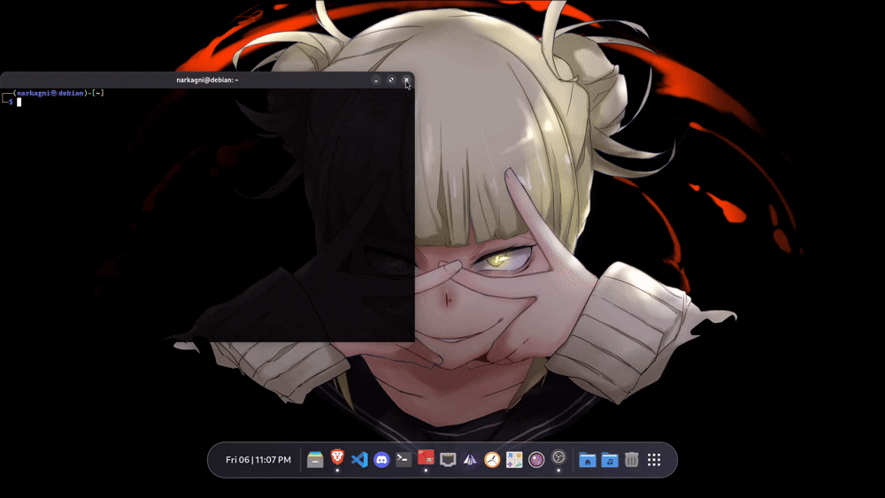
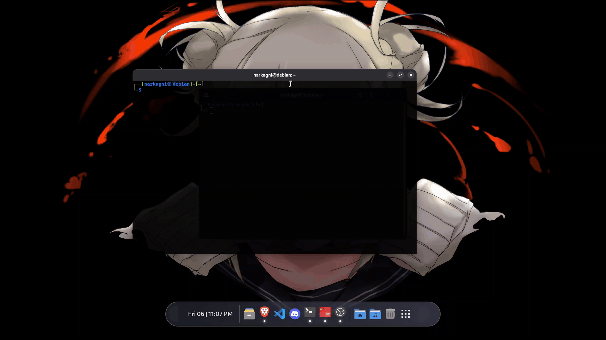
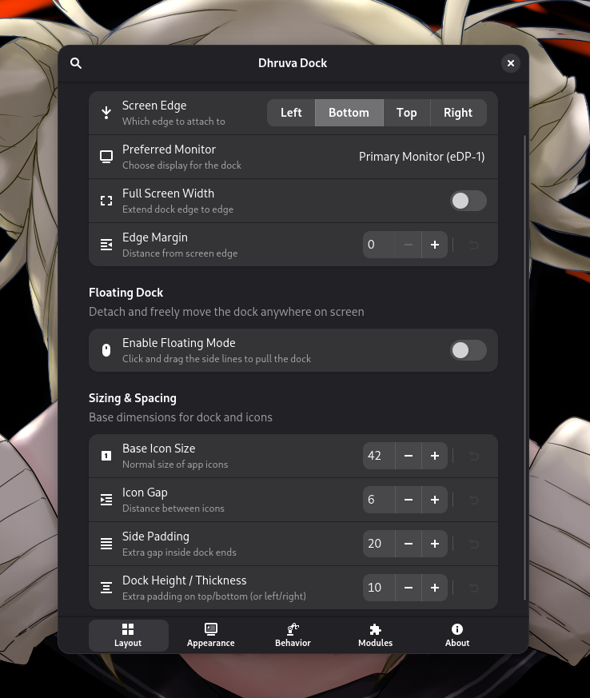
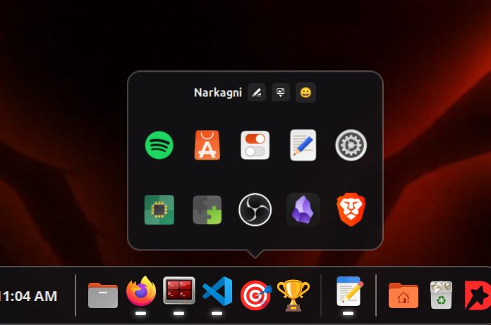
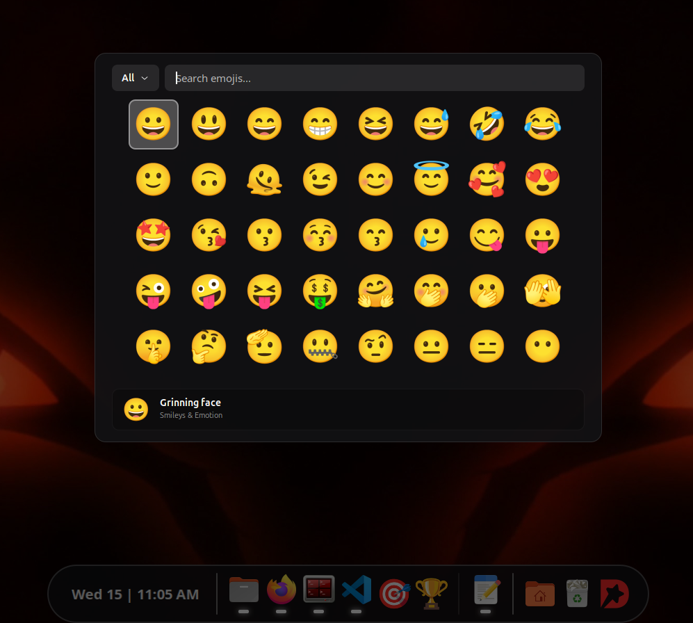

<div align="center">


<h1>Dhruva</h1>

<p><strong>A buttery smooth, deeply animated dock for GNOME Shell</strong></p>
<p>Built with obsessive attention to detail - every pixel, every animation, every setting.</p>

<br>


&nbsp

&nbsp


<br><br>

<a href="https://extensions.gnome.org/extension/9495/dhruva/">
  
</a>
&nbsp&nbsp
<a href="https://buymeacoffee.com/narkagni">
  
</a>

</div>

<br>

---

## Overview

Dhruva is a **feature-complete dock extension** for GNOME Shell that does not compromise.

Most dock extensions give you a panel and call it a day. Dhruva gives you real magnification, six window minimize effects with custom physics, 20+ icon click animations, a floating mode with elastic pull-out, a Chameleon theme engine that reads your wallpaper, Aero Peek-style window previews, workspace isolation, and a fully modular preferences window - all in a single extension.

> Whether you're a minimalist who just wants a clean bottom bar, or a power user who wants every detail dialed in - **Dhruva adapts to you.**

<br>

---

## Gallery

<div align="center">
  
  <p><sub>The dock in action - smooth magnification, running indicators, and glassmorphism context menu</sub></p>
</div>

<br>

<table>
  <tr>
    <td align="center" width="50%">
      
      <br><br><sub><b>True Magnification</b></sub>
    </td>
    <td align="center" width="50%">
      
      <br><br><sub><b>Window Minimize & Restore Effects</b></sub>
    </td>
  </tr>
  <tr>
    <td align="center" width="50%">
      
      <br><br><sub><b>Floating Mode with D-Shape Handles</b></sub>
    </td>
    <td align="center" width="50%">
      
      <br><br><sub><b>Glassmorphism Context Menu + Aero Peek</b></sub>
    </td>
  </tr>
  <tr>
    <td align="center" width="50%">
      
      <br><br><sub><b>Icon Click Effects</b></sub>
    </td>
    <td align="center" width="50%">
      
      <br><br><sub><b>Fully-Featured Preferences Window</b></sub>
    </td>
  </tr>
  <tr>
    <td align="center" width="50%">
      
      <br><br><sub><b>Stack & Folder Groups</b></sub>
    </td>
    <td align="center" width="50%">
      
      <br><br><sub><b>Emojis for Icons</b></sub>
    </td>
  </tr>
</table>

<br>

---

## Features

### Placement & Layout

- **Omni-Directional** - Place the dock on any screen edge: Bottom, Top, Left, or Right
- **Full-Width Mode** - Extend the dock edge-to-edge with Start / Center / End icon alignment
- **Multi-Monitor Support** - Pin the dock to any connected display
- **Edge Margin** - Fine-tune the distance from the screen edge
- **Dock Height & Padding** - Full control over thickness and internal spacing

### Floating Dock

- **Drag-to-Float** - Pull the dock off the edge with the D-shape side handles
- **Elastic Pull Animation** - Fluid deform effect as you drag the dock out
- **Fully Configurable Handles** - Adjust handle length, thickness, curve, offset, gap, and opacity
- **Floating Opacity** - Set a separate transparency level for the floating dock
- **Hover-to-Reveal** - Instantly go full opacity when your cursor enters the floating dock

### True Magnification

- **Real-time Zoom** - Icons scale up as the cursor approaches
- **Smooth Interpolation** - Neighboring icons scale proportionally for a fluid wave effect
- **Adjustable Zoom Factor** - Dial in exactly how large icons grow

### Window Effects

Six handcrafted **minimize & restore animations**, all taring the exact dock icon position:

| Effect | Description |
|:---|:---|
| **Magic Lamp** | Classic genie suck-into-dock |
| **Snake** | Window slithers into the icon |
| **Vortex** | Spiraling collapse into the dock |
| **Origami** | Paper-fold style unfold/fold |
| **Jelly** | Elastic, wobbly minimize |
| **CRT** | Retro TV scanline shutdown effect |

Plus an animated **app launch effect** - new windows burst open from the icon position.

### Icon Click Animations

**22 distinct click effects** to give every tap satisfying feedback:

`bounce` · `jump` · `heartbeat` · `squish` · `jelly` · `spin` · `spin_3d` · `flip` · `roll` · `zoom_fade` · `squeeze` · `glow` · `dim` · `tada` · `swing` · `shake` · `move_up` · `move_down` · `move_left` · `move_right` · `enlarge` · `shrink`

### Themes & Appearance

- **10 Preset Themes** - Carefully designed for Linux desktops:

  *Solid:* Carbon · Nord · Catppuccin Mocha · Gruvbox Dark · Ash Glass

  *Gradient:* Dracula · Tokyo Night · Aurora · Sunset · Slate Ocean

- **Chameleon Engine** - Automatically extracts your wallpaper's dominant color and applies it to the dock background, gradient, and running indicators in real time
- **Custom Color Mode** - Full control: background color, gradient, direction, and opacity
- **Border Radius** - Round the corners to your liking
- **Stroke / Border** - Add an outer outline with custom color, width, and opacity

### Running Indicators

- Toggle indicators on/off
- **5 indicator styles**: Dot · Line · Square · Triangle · Dash
- Custom indicator color (or automatic Chameleon color matching)
- Adjustable size, spacing, and glow effect

### Context Menu & Aero Peek

- **Glassmorphism Context Menu** - Right-click any icon for a sleek blurred panel
- **Window List** - See all open windows for an app, with thumbnail previews
- **Aero Peek** - Hover over a window entry to preview it live on screen
- **Peek Speed** - Adjustable animation speed
- **Quick Actions** - Launch new window, move to workspace, force quit, open settings

### Auto-Hide

- **Smart Auto-Hide** - Hides when a window overlaps stays visible otherwise
- **Dodge Mode** - Duck only when the active window is in the way
- **Always Visible** - Disable auto-hide entirely
- **Edge Pressure Reveal** - Hover the screen edge to summon the dock
- **Custom Delays** - Separate hide delay, unhide delay, and edge dwell time

### Stack & Folder Groups *(New)*

- **Icon Stacking** - Hold `Ctrl` and drag one icon onto another to instantly create a grouped stack or folder right on the dock
- **Mouse-Driven Grouping** - No menus or setup required pure drag-and-drop with your mouse
- **Clean & Native** - Stacks look and feel like a regular dock icon or use Emojis as icon

### Import & Export Settings *(New)*

- **Export Your Setup** - Save your entire dock configuration - themes, animations, layout, modules - into a single portable file
- **Import with One Click** - Restore or switch your entire style instantly from a saved config
- **Share Your Theme** - Send your dock setup to friends or the community they can load it in seconds
- **Safe Backup** - Back up before reinstalling or experimenting, then restore in one click

### Modules & Quick Access

Built-in dock modules you can toggle individually:

- **App Grid Button** - One click to GNOME's app overview (configurable position)
- **Trash** - Drag files onto it animated shred effect on empty
- **Desktop Button** - Show/hide the desktop
- **Home / Downloads / Documents / Pictures / Videos / Music** - Quick folder access
- **Custom Folders** - Add any directory as a dock module
- **Integrated Clock** - Show time directly on the dock with adjustable size and position (Start / End)

### Behavior & Power Features

- **Workspace Isolation** - Show only the apps open in the current workspace
- **Scroll to Cycle** - Scroll over the dock to switch workspaces, or scroll an app to cycle its windows
- **Lock Icons** - Prevent accidental reordering with a single toggle
- **Drag & Drop Reorder** - Rearrange icons freely with smooth live reflow
- **Tooltips** - App name tooltips on hover with adjustable margin

<br>

---

## Installation

### From GNOME Extensions *(Recommended)*

The easiest way - no terminal needed. Click install, enable, and you're done.

<div align="center">
  <a href="https://extensions.gnome.org/extension/9495/dhruva/">
    
  </a>
</div>

<br>

### From Source

**Requirements:** GNOME Shell 45–50 · `libglib2.0-bin`

```bash
# 1. Clone the repository
git clone https://github.com/narkagni/dhruva.git
cd dhruva

# 2. Install
make install

# 3. Restart GNOME Shell
#    X11:     Alt+F2 → type 'r' → Enter
#    Wayland: Log out and back in

# 4. Enable the extension
gnome-extensions enable dhruva@narkagni
```

To uninstall:
```bash
make uninstall
```

<br>

---

## ☕ Support Development

Dhruva is **completely free and open-source** - no ads, no subscriptions, no paywalls, ever.

Every feature you see - the smooth animations, the Chameleon engine, the floating dock physics, the glassmorphism menus, the 22 click effects - is designed, coded, and maintained in spare time. This project exists purely out of love for a beautiful Linux desktop.

If Dhruva brought a little joy to your daily workflow, consider showing some love back. Even the price of a single coffee keeps the motivation alive and helps fund new features, bug fixes, and better documentation.

**You don't have to. But if Dhruva made your desktop feel a little more *you* - it would mean a lot. 🙏**

<div align="center">

<br>

<a href="https://buymeacoffee.com/narkagni">
  
</a>

<br><br>

*Not in a position to donate? A GitHub ⭐ star or sharing Dhruva with a friend is just as appreciated!*

</div>

<br>

<details>
  <summary><b>Crypto Donations</b></summary>
  <br>

  Prefer crypto? Every satoshi and gwei is deeply appreciated - thank you for supporting open-source!

  **Bitcoin (BTC)**
  ```
  1GSHkxfhYjk1Qe4AQSHg3aRN2jg2GQWAcV
  ```
  **Ethereum (ETH)**
  ```
  0xf43c3f83e53495ea06676c0d9d4fc87ce627ffa3
  ```
  **Tether (USDT - TRC20)**
  ```
  THnqG9nchLgaf1LzGK3CqdmNpRxw59hs82
  ```
</details>

<br>

---

<div align="center">

Made with ❤️ by **[Narkagni](https://github.com/narkagni)** &nbsp·&nbsp GPL-3.0 License

*If you enjoy Dhruva, share it with someone who deserves a beautiful Linux desktop.*

</div>
